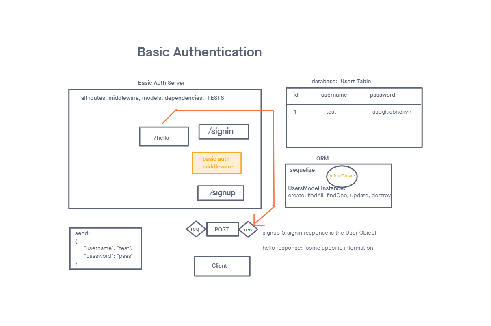

# Lab-06

## Basic Auth

### Author: Alan Chelko

### Problem Domain

    * Deploy an Express server that implements Basic Authentication, with signup and signin capabilities, using a Postgres database for storage:
      * Users Model (Postgres Schema)
      * /signup route that creates a user
      * /signin route that attempts to log a user in
      * BasicAuth middleware that validates the user as a part of the /signin process

### Testing

    * POST to /signup to create a new user
    * POST to /signin to login as a user (use basic auth)
    * Need tests for auth middleware and the routes

### Setup

    * PORT: 3001

### Deployed server

    * Heroku: [chelko-basic-api-server-prod](https://dashboard.heroku.com/apps/chelko-auth-app-prod/)

### Running the app

    * npm start
    * Endpoint: '/'
        * Returns 'Hello, welcome to the World of User Auth!'
    * Endpoint: '/signup'
        * POST signup to create an account with username and password
    * Endpoint: '/signin'
        * POST to login with existing username and password
    *  Enpoint: '/*'
        * Returns object with 'not found' 404 error

### Tests

    * npm test

### UML: Basic Auth Server -- Lab 06 UML

